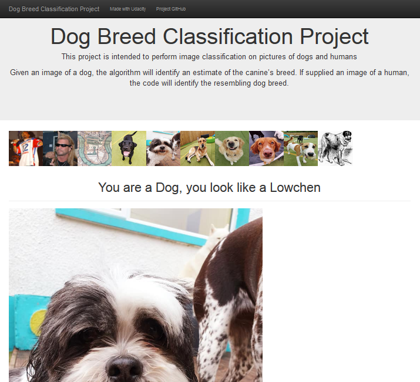

# Dog Breed Classification Project
 (Udacity DSND Project: Capstone Project)

This project is intended to perform image classification on pictures of dogs and humans.

Given an image of a dog, the algorithm will identify an estimate of the canine’s breed.  If supplied an image of a human, the code will identify the resembling dog breed.


## Table of Contents

1. [Instructions](#instructions)
2. [Results](#results)
3. [Project Organisation](#project)
5. [Licensing, Authors, and Acknowledgements](#licensing)


## Instructions <a name="instructions"></a>

This project requires Python 3 and the libraries found in the [requirements.txt](requirements.txt).

There are various ways to install and run the machine learning pipeline - Mac or Linux or Windows, local or AWS, CPU or GPU supported. For detailed instructions please see https://github.com/udacity/dog-project. After installation configure the following in your environment/session...

```
set KERAS_BACKEND=tensorflow
python -c "from keras import backend"
python -m ipykernel install --user --name dog-project --display-name "dog-project"
```

Once your environment is setup and configured, the whole pipeline can be run from the [dog_app.ipynb](dog_app.ipynb) notebook.

Run the following command to launch the (local) web app...

```
python app/run.py
```


## Results <a name="results"></a>

### Machine Learning Pipeline

At each stage Accuracy was used to measure performance of the model. Also Categorical Cross-Entropy was used during training of the Dog breed classifiers.

1. **Face detector**: I used a pre-trained Haar feature-based cascade classifier for this. It was 99% accurate at identifying a sample of 13,233 human faces, but also identified 11% of 6,680 dog faces as human - so is not perfect! Note also it requires clearly presented faces to work. There is room for improvement here - either by tuning this model or using an alternative.

2. **Dog detector**: Here, I used a pre-trained ResNet-50 model to identify dogs. In this case, the model was 99% accurate with samples of both 13,233 human faces and 6,680 dogs.

3. **Dog breed classification**: For the final model I experimated with a scratch CNN (4% accuracy), VGG-16 bottleneck features (42% accuracy) and ResNet-50 bottleneck features (81% accuracy). ResNet-50 was the clear winner so that formed part of the final algrothim. I would still like to look at tuning this model further though.

4. **Final Algorithm**: This was the final stage of my pipeline which combined the 3 models above to output the prediction for any given image. Knowing the accuracy we achieved with each of the 3 models, I only performed some sanity checks on a handful of images at this point. The results were looking good enough to implement within an application :)

### Web Application

The web app displays all images included in the `app/static` folder and predictions are calculated by clicking on the image...



The app could be improved in a number of ways, e.g.
* Speed it up - the prediction algorithm is a little slow currently
* More input options - image upload or even web urls
* More detail on confidence of prediction - probabilities


## Project Organisation <a name="project"></a>


    ├── app                   
    │   ├── static                              <- Images for use in web app
    │   ├── templates                            
    │   │   └── master.html                     <- HTML template for main page
    │   └── run.py                              <- Script to launch app, make predictions, etc
    │
    ├── bottleneck_features
    │   ├── DogResnet50Data.npz                 <- Pre-trained ResNet-50 model (excluded from repo)
    │   └── DogVGG16Data.npz                    <- Pre-trained VGG-50 model (excluded from repo)
    │
    ├── haarcascades                             
    │   └── haarcascade_frontalface_alt.xml     <- Pre-trained Haar cascade face detector
    │
    ├── images                                  <- Images used in ML pipeline
    │
    ├── saved_models
    │   ├── model.final.hdf5                    <- Final CNN model
    │   ├── weights.best.from_scratch.hdf5      <- Weights for scratch CNN (excluded from repo)
    │   ├── weights.best.ResNet50.hdf5          <- Weights for ResNet-50 CNN
    │   └── weights.best.VGG16.hdf5             <- Weights for VGG-50 CNN (excluded from repo)
    │
    ├── LICENSE.txt                             <- Software licence
    ├── README.md                               <- The top-level README for developers using this project
    ├── Procfile                                <- Heroku config file
    ├── app_screenshot.png                      <- Screenshot of web app
    ├── dog_app.ipynb                           <- Pipeline for creating, training and testing model
    ├── extract_bottleneck_features.py          <- Helper functions for predictions on pre-trained models
    ├── report.html                             <- Static export of dog_app.ipynb
    └── requirements.txt                        <- Required Python packages


## Licensing, Authors, Acknowledgements <a name="licensing"></a>

Acknowledgement to Udacity for the starter code on this project and a big thankyou to my course mentor [NicoEssi](https://github.com/NicoEssi) for his advice and support.

Additional images are sourced from [Wikimedia Commons](https://commons.wikimedia.org/wiki/) and (with permission) [Doggos Doggy Day Care](https://www.facebook.com/doggosdoggydaycaredromore/).
